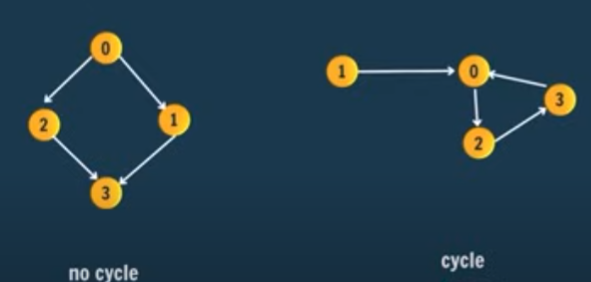

# Cycle Detection
[Graph](graph.md)

## Undirected Graph
* Given an undirected graph with `V` vertices labelled from `0` to `V-1` and `E` edges, check whether it contains any cycle or not. Graph is in the form of adjacency list where `adj[i]` contains all the nodes ith node is having edge with.
[Problem](https://www.geeksforgeeks.org/problems/detect-cycle-in-an-undirected-graph/1?itm_source=geeksforgeeks&itm_medium=article&itm_campaign=bottom_sticky_on_article)
* You don't want to return true, just because you encountered parent in neighbour list. Just keep track of parent node, and you will be fine. 
``` java
class Solution {
    public boolean dfsCycleDetection(ArrayList<ArrayList<Integer>> adj, boolean[] visited, int parent, int node) {
        visited[node] = true;
        
        for(Integer neighbour : adj.get(node)) {
            if(!visited[neighbour]) {
                if(dfsCycleDetection(adj, visited, node, neighbour)) {
                    return true;
                }
            } else if(neighbour != parent) {
                return true;
            }
        }
        return false;
    }
    // Function to detect cycle in an undirected graph.
    public boolean isCycle(int V, ArrayList<ArrayList<Integer>> adj) {
        boolean[] visited = new boolean[V];
        for(int i = 0; i < V; i++) {
            if(!visited[i]) {
                if(dfsCycleDetection(adj, visited, -1, i)) {
                    return true;
                }
            }
        }
        return false;
    }
}
```

## Directed Graph
* Given a Directed Graph with V vertices (Numbered from 0 to V-1) and E edges, check whether it contains any cycle or not.
[Problem](https://www.geeksforgeeks.org/problems/detect-cycle-in-a-directed-graph/1)

* Instead of keeping track of the parent node, use a recursion stack to track all nodes on the current path.
* A stack is not an efficient data structure for repeatedly checking whether a node has been encountered previously in the path.
* However, we only need a list of nodes on the path, and the order does not matter, so we can use a boolean array similar to the visited array.
* When encountering an unvisited node, add it to the path by setting its corresponding boolean value to true. During backtracking, mark it as false again to remove it from the path.

``` java
class Solution {
    public boolean dfsCycleDetection(ArrayList<ArrayList<Integer>> adj, boolean[] visited, boolean[] path, int node) {
        visited[node] = true;
        path[node] = true;
        
        for(Integer neighbour : adj.get(node)) {
            if(path[neighbour]) {
                return true;
            } else if(!visited[neighbour]) {
                if(dfsCycleDetection(adj, visited, path, neighbour)) {
                    return true;
                }
            }
        }
        path[node] = false;
        return false;
    }
    // Function to detect cycle in a directed graph.
    public boolean isCyclic(int V, ArrayList<ArrayList<Integer>> adj) {
        boolean[] visited = new boolean[V];
        boolean[] path = new boolean[V];
        
        for(int i = 0; i < V; i++) {
            if(!visited[i]) {
                if(dfsCycleDetection(adj, visited, path, i)) {
                    return true;
                }
            }
        }
        return false;
    }
}
```
